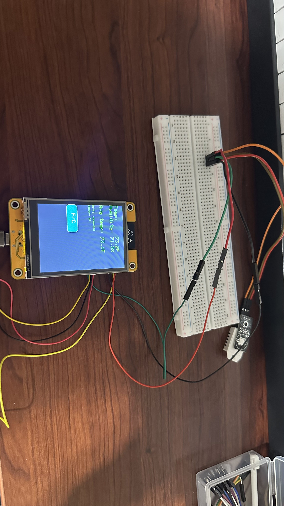
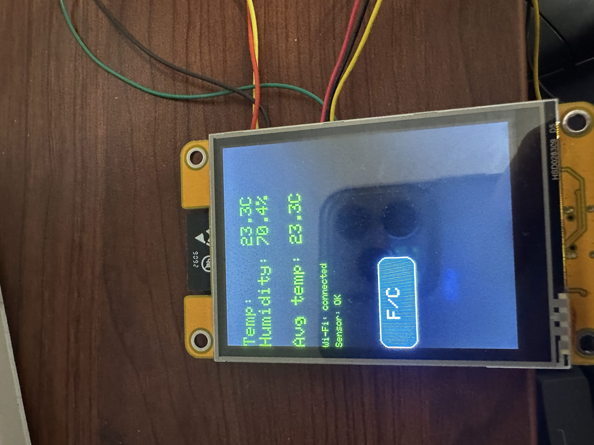
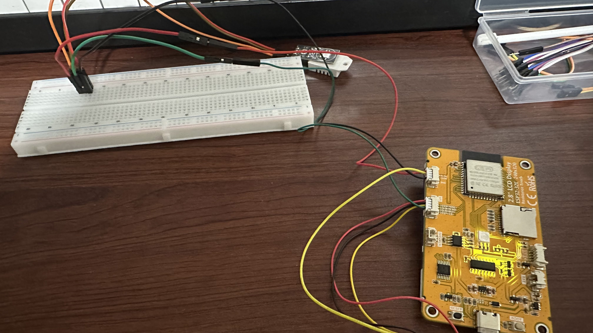

# ESP32 Environment Monitor

This project is a small ESP32-based temperature and humidity monitor built around a DHT22 sensor and a touchscreen display.

The ESP32 reads the sensor every 10 seconds, displays the current values on-screen, keeps a rolling temperature history, and exposes the readings through a simple JSON REST API over Wi-Fi.

The touchscreen can switch the displayed temperature between Celsius and Fahrenheit. The API always returns temperature values in Celsius.



## Features

* DHT22 temperature and humidity readings
* Touchscreen display
* Celsius/Fahrenheit toggle
* Rolling average based on the last 50 valid temperature readings
* Non-blocking sensor timing using `millis()`
* Wi-Fi connectivity
* JSON REST API
* Automatic Wi-Fi retry if the connection is lost
* Basic handling for invalid or disconnected sensor readings



## Hardware

The project currently targets an ESP32 using the Arduino framework through PlatformIO.



| Signal                         | ESP32 GPIO   |
| ------------------------------ | ------------ |
| DHT22 data                     | 27           |
| TFT MISO / MOSI / clock        | 12 / 13 / 14 |
| TFT chip select / data-command | 15 / 2       |
| TFT backlight                  | 21           |
| Touch data out / data in       | 39 / 32      |
| Touch chip select / clock      | 33 / 25      |

The display uses an ILI9341 controller in portrait orientation.

Display configuration can be found in:

`lib/TFT_eSPI/User_Setup.h`

Touch input uses the `TFT_Touch` library separately from TFT_eSPI.

If the screen or orientation is changed, the touchscreen may need to be recalibrated using the calibration example included with `TFT_Touch`.

## Building the Project

This project uses PlatformIO.

1. Clone or download the repository.

2. Open the project in VS Code with PlatformIO installed.

3. Copy:

   `src/secrets_example.h`

   to:

   `src/secrets.h`

4. Add your Wi-Fi SSID and password to `secrets.h`.

`secrets.h` is ignored by Git so Wi-Fi credentials are not committed to the repository.

Build the firmware with:

```bash
pio run
```

Upload it to the ESP32 with:

```bash
pio run --target upload
```

To view serial output:

```bash
pio device monitor --baud 9600
```

Once connected to Wi-Fi, the ESP32 prints its local IP address to the serial monitor.

The REST API can then be accessed over HTTP from another device on the same local network.

## How It Works

Sensor readings are taken approximately every 10 seconds without blocking the rest of the program.

Valid temperature readings are stored in a fixed circular buffer containing up to 50 samples. Once the buffer is full, new readings replace the oldest readings.

The average temperature is calculated from the readings currently stored in that buffer.

If the DHT22 returns an invalid reading, that reading is ignored instead of being added to the temperature history. The display and API also indicate when the current sensor reading is unavailable.

Wi-Fi connection attempts are also handled without stopping the sensor and touchscreen logic. If Wi-Fi is unavailable, the device continues working locally and periodically attempts to reconnect.

## Project Structure

The firmware was split into a few smaller modules instead of keeping everything inside `main.cpp`.

* `main.cpp` — coordinates sensor timing, display updates, touch input, Wi-Fi, and the API
* `sensor_manager.cpp` — communicates with the DHT22
* `sensor_state.h` — manages sensor validity and temperature history
* `wifi_manager.cpp` — handles Wi-Fi connection and reconnection
* `api_server.cpp` — defines REST API routes and responses

This made the firmware easier to follow and kept hardware-specific responsibilities separated.

## JSON API

The ESP32 runs a small HTTP server on port 80.

All routes below use `GET` and return JSON.

| Route          | Example Response                                                                           |
| -------------- | ------------------------------------------------------------------------------------------ |
| `/readings`    | `{"temperature_c":23.50,"humidity":48.20}`                                                 |
| `/temperature` | `{"temperature_c":23.50}`                                                                  |
| `/humidity`    | `{"humidity":48.20}`                                                                       |
| `/averagetemp` | `{"average_temperature_c":23.10}`                                                          |
| `/status`      | `{"reading_valid":true,"sample_count":12,"last_sample_age_ms":1500,"wifi_connected":true}` |

For example:

```bash
curl http://DEVICE_IP/readings
```

`sample_count` represents the number of valid temperature readings currently stored in the circular buffer, up to a maximum of 50.

If a sensor value is unavailable, the API returns `null` for that value instead of returning an invalid measurement.

The API is intended for use on a local network and currently does not include authentication or TLS.

## Testing

Some of the sensor-state logic can be tested on a PC without having the ESP32 connected.

On Windows:

```powershell
powershell -NoProfile -ExecutionPolicy Bypass -File test/run_host_tests.ps1
```

These tests cover areas such as:

* Empty sensor history
* Averaging with a partially filled buffer
* Circular buffer wraparound
* Invalid sensor readings
* Recovery after an invalid reading
* Timer rollover behavior

I also tested the project on the actual hardware, including:

* Temperature and humidity updates
* Celsius/Fahrenheit switching
* Wi-Fi connection and reconnection
* REST API responses
* Sensor disconnection and recovery
* Circular buffer averaging

## Development Notes

The original version of this project was developed as a learning project while I was getting more comfortable with embedded C++ and the ESP32.

After the core project was working, I used an AI coding agent during the final cleanup stage to help refactor the code, improve error and connection handling, add tests, organize files, and create initial documentation. I reviewed the changes afterward and tested the firmware to make sure everything still behaved as expected.

I kept the AI-assisted cleanup in a separate commit so the development history and original implementation process remain visible.

This project also gave me experience with:

* Embedded C++
* GPIO and sensor communication
* Touchscreen input
* Non-blocking timing
* Circular buffers
* Wi-Fi networking
* REST APIs
* Separating firmware into smaller modules
* Debugging software alongside physical hardware
